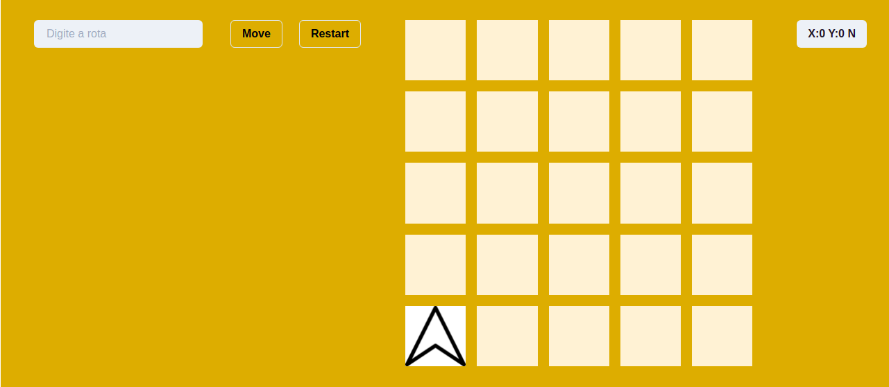

# Desafio Robot Nasa

Seja bem vindo ao desafio Robot Nasa!!

Este projeto foi desenvolvido como uma etapa no processo seletivo da empresa **UME**.

## O Problema:

A posição do robô é representada pela combinação de coordenadas cartesianas (x, y) e por uma letra, que pode representar uma das quatro orientações: NORTH, SOUTH, EAST e WEST. Para simplificar a navegação, a região a ser explorada foi subdividia em sub-regiões retangulares.
Uma posição válida de um robô, seria (0, 0, N), que significa que o robô está posicionado no canto esquerdo inferior do terreno, voltado para o Norte.

Exemplo: Assuma que um robô se movimenta para o NORTE em relação ao eixo y. Ou seja, um passo para o NORTE da posição (x,y), é a posição (x, y+1)
Exemplo: Se o robô está na posição (0,0,N), o comando "MML" fará ele chegar na posição (0,2,W)

## Rodando o projeto

Para rodar o projeto instala-se as dependências com `yarn` ou `npm install`, para rodar apenas com o comando `yarn dev` ou `npm start`.
Para o desenvolvimento foi usada a biblioteca yarn.

## Estruturação do projeto

O projeto segue estruturado em pastas onde temos a pasta components que contém todos os componentes usados.

#### Ferramentas.

O projeto foi desenvolvido com a linguagem `JavaScript` e a biblioteca `react`. Como pre processador de css foi utilizado o chakra ui.

## Estratégia de desenvolvimento.

Dado que para se ter um código legível e menos verboso o projeto está dividido em componentes de estilos e componentes de lógica. Os componentes `CheckPosition` e `Rota` são onde estão contidos a maior parte da lógica implementada neste projeto. Esta estratégia foi adotada para se evitar um código muito verboso além de facilitar a manutenção.

## Melhorias futuras.

Dada a condição de tempo, o produto até então desenvolvido trata-se da versão 0. Como versão 1 foram pensadas algumas melhorias tais como:
<li>Ao clicar em um dos botões da lista de posições, o robô seria movido para a posição.
<li>Implementar a lógica de mover os robôs através das setas do teclado, por exemplo: Ao clicar na seta cima, o robô move uma casa para a direção norte.
<li>A construção de um Back-End constituído de uma API REST para processar a lógica do movimento do robô.

## Considerações finais

As práticas desenvolvidas levaram em consideração uma boa qualidade de código mas tambem visando entregar em tempo hábil.
